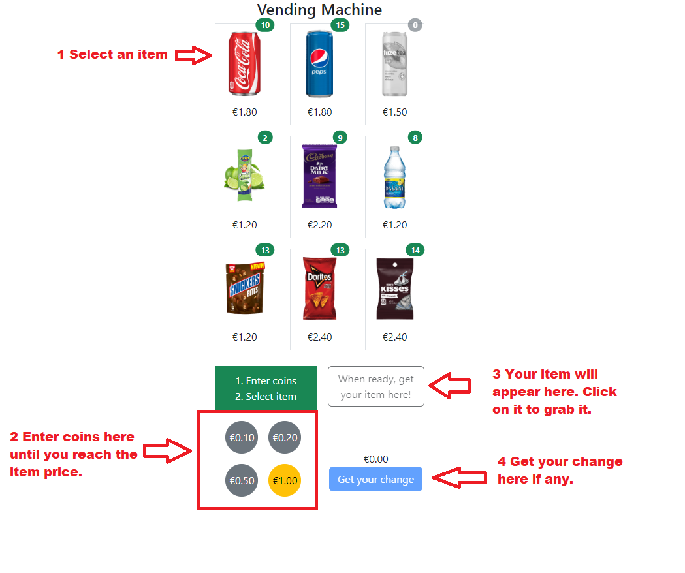

# Angular Vending Machine

## Introduction

Basic example of a vending machine using Angular. It will do the basic things that you might expect a vending machine to do. Accept money, return change, maintain inventory, and dispense products.

This project was generated with [Angular CLI](https://github.com/angular/angular-cli) version 14.2.3.

## Running the app

Clone this repository and install the dependencies

```bash
npm install
```

Run `npm run start` to start the server. Navigate to `http://localhost:4200/`. The application will automatically reload if you change any of the source files.

## How it works?



Once a item reach a quantity of 0, it will be disabled.

>Currency: by default it is using `EUR` and is configured in the app environment.

## Build

Run `npm run build` to build the project. The build artifacts will be stored in the `dist/` directory.

## Running unit tests

Run `npm run test` to execute the unit tests via [Karma](https://karma-runner.github.io).

>TODO: add more tests
